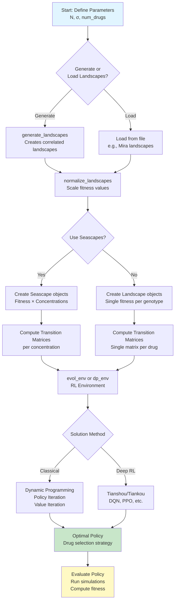
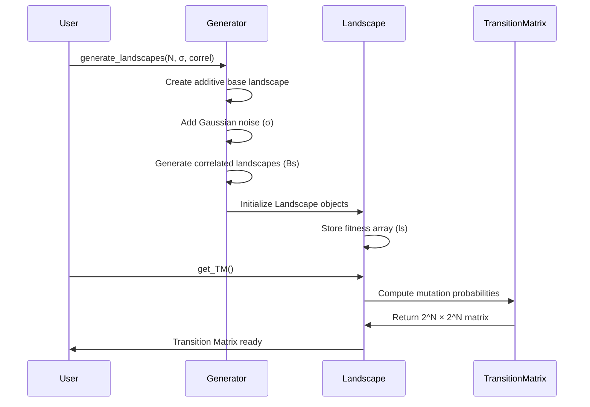
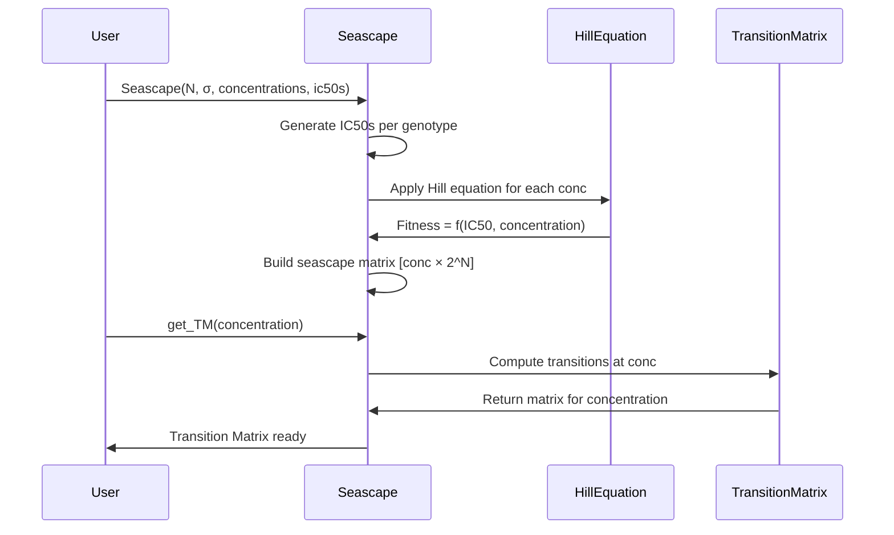

# evodm

<!-- badges -->
[](https://github.com/DavisWeaver/evo_dm/actions)
[](https://codecov.io/gh/DavisWeaver/evo_dm)
[](https://www.gnu.org/licenses/gpl-3.0)
<!-- badges end -->

**evodm** (Evolutionary Drug Management) is an RL-based framework for discovering optimal drug scheduling policies that control bacterial and carcinomic populations. It bundles classical MDP solvers, deep RL learners, landscape generators, and experiment utilities so you can reproduce published benchmarks or plug in your own models.

> Original Authors: Davis Weaver and Jeff Maltas  
> V2 Maintainer: Chaaranath Badrinath

## Table of Contents

- [Features](#features)
- [Architecture Overview](#architecture-overview)
  - [Landscape vs Seascape](#landscape-vs-seascape)
  - [System Architecture Flow](#system-architecture-flow)
  - [Landscape Generation Process](#landscape-generation-process)
  - [Seascape Generation Process](#seascape-generation-process)
  - [MDP/RL Environment Setup](#mdprl-environment-setup)
  - [Key Concepts](#key-concepts)
- [Project Structure](#project-structure)
- [Getting Started](#getting-started)
- [Development Workflow](#development-workflow)
- [Running Experiments](#running-experiments)
- [Testing](#testing)
- [FAQ](#faq)
- [Citation](#citation)
- [License](#license)

## Features

- **Deterministic & stochastic environments** via `evodm.evol_game` and `evodm.dpsolve`
- **Classical RL**: dynamic programming solvers, policy iteration, and heuristics
- **Deep RL**: Tiankou + Tianshou integrations for modern policy learning
- **Landscape utilities**: generation, normalization, selectivity estimation, and visualization helpers
- **Experiment harnesses**: reproducible sweeps, Mira benchmarks, seascape simulations, and logging utilities
- **Research-friendly tooling**: notebooks, scripts, and data directories scaffolded for typical ML experimentation

## Architecture Overview

### Landscape vs Seascape

**Landscape** represents a static fitness landscape where each genotype (bit sequence of length N) has a single fitness value. This models drug effects at a fixed concentration.

**Seascape** extends Landscape to model dose-dependent effects, where fitness varies with drug concentration. This enables more realistic modeling of drug resistance and concentration-dependent selection.

```mermaid
graph TB
    subgraph "Landscape Structure"
        L[Landscape<br/>N genotypes, σ epistasis]
        L --> |"2^N genotypes"| G[Genotype 0000<br/>Genotype 0001<br/>...<br/>Genotype 1111]
        G --> |"Single fitness value"| F[Fitness Array<br/>ls: [f₀, f₁, ..., f₂ᴺ⁻¹]]
        F --> |"get_TM()"| TM[Transition Matrix<br/>2^N × 2^N<br/>Mutation probabilities]
    end
    
    subgraph "Seascape Structure"
        S[Seascape<br/>extends Landscape]
        S --> |"Multiple concentrations"| C[Concentrations<br/>[0.1, 0.05, ..., 0.0] M]
        C --> |"For each conc"| SS[Seascape Matrix<br/>ss: [conc × 2^N]<br/>Fitness per genotype per conc]
        SS --> |"get_TM(conc)"| TM2[Transition Matrix<br/>per concentration]
        S -.->|"Inherits from"| L
    end
```

### System Architecture Flow



### Landscape Generation Process



### Seascape Generation Process



### MDP/RL Environment Setup

```mermaid
graph LR
    subgraph "Input"
        L1[Landscape 1<br/>Drug A]
        L2[Landscape 2<br/>Drug B]
        L3[Landscape N<br/>Drug N]
    end
    
    subgraph "Transition Matrices"
        TM1[TM₁: 2^N × 2^N]
        TM2[TM₂: 2^N × 2^N]
        TMN[TMₙ: 2^N × 2^N]
    end
    
    subgraph "MDP Environment"
        STATES[States: 2^N genotypes<br/>s ∈ {0, 1, ..., 2^N-1}]
        ACTIONS[Actions: N drugs<br/>a ∈ {0, 1, ..., N-1}]
        TRANS[Transitions: P[s'|s,a]<br/>From TM matrices]
        REWARDS[Rewards: R(s,a,s')<br/>1 - fitness(s')]
    end
    
    subgraph "Policy Learning"
        DP[DP Solvers<br/>Policy/Value Iteration]
        RL[Deep RL<br/>Tianshou Agents]
    end
    
    L1 --> TM1
    L2 --> TM2
    L3 --> TMN
    
    TM1 --> TRANS
    TM2 --> TRANS
    TMN --> TRANS
    
    STATES --> TRANS
    ACTIONS --> TRANS
    TRANS --> REWARDS
    
    REWARDS --> DP
    REWARDS --> RL
    
    DP --> POLICY[Optimal Policy<br/>π*: S → A]
    RL --> POLICY
```

### Key Concepts

**Genotype Space**: For N bits, there are 2^N possible genotypes (e.g., N=4 → 16 genotypes: 0000, 0001, ..., 1111)

**Fitness Landscape**: Maps each genotype to a fitness value. Higher fitness = better survival/reproduction under selection.

**Transition Matrix (TM)**: 2^N × 2^N matrix where TM[i,j] = probability of mutating from genotype i to j in one step.

**Epistasis (σ)**: Controls landscape ruggedness. σ=0 → smooth (additive), σ>0 → rugged (epistatic interactions).

**Seascape**: Extends landscape to model concentration-dependent fitness, enabling dose-response modeling.

## Project Structure

```
evo_dm/
├── evodm/               # Main package (environments, learners, utilities)
├── tests/               # Pytest test suite with shared fixtures
├── docs/                # Documentation entry point
├── scripts/             # Helper scripts (e.g., import organization)
├── notebooks/           # Jupyter notebooks for exploration
├── data/                # data/raw & data/processed (kept empty via .gitkeep)
├── results/             # Experiment outputs (gitignored except .gitkeep)
├── pyproject.toml       # Packaging + tooling configuration
├── uv.lock              # uv dependency lockfile
└── README.md
```

## Getting Started

### Prerequisites

- Python 3.9+  
- [uv](https://docs.astral.sh/uv/) (recommended) or pip

Install uv (macOS/Linux):

```bash
curl -LsSf https://astral.sh/uv/install.sh | sh
```

### Install Dependencies

```bash
# Clone the repo
git clone https://github.com/DavisWeaver/evo_dm.git
cd evo_dm

# Create virtual environment (optional but recommended)
uv venv
source .venv/bin/activate  # or .venv\Scripts\activate on Windows

# Install project in editable mode with dev deps
uv pip install -e ".[dev]"
```

## Development Workflow

### Format and Organize Imports

```bash
# Sort imports across evodm/, tests/, scripts/
uv run ruff check --select I --fix evodm tests scripts
```

### Run Static Checks (optional)

```bash
uv run ruff check evodm tests
uv run mypy evodm
```

## Running Experiments

Example commands (see `evodm/examples/` and `scripts/` for more):

```bash
# Mira MDP example
uv run python -m evodm.examples.mira_mdp

# Tianshou training harness
uv run python -m evodm.tianshou_learner
```

You can store logs in `results/` and raw datasets in `data/raw/`. Processed artifacts can live in `data/processed/`.

## Testing

```bash
uv run pytest
```

## FAQ

**Q: Why uv?**  
uv provides deterministic dependency resolution and fast installs. The generated `uv.lock` keeps builds reproducible.

**Q: Are `__pycache__` directories safe to delete?**  
Yes. They are regenerated automatically and are gitignored.

**Q: Where do notebooks live?**  
Put exploratory notebooks in `notebooks/`. They are ignored by default except for documentation.

## Citation

If you use this project in academic work, please cite the original authors:

```
Davis Weaver, Jeff Maltas. "evodm: Evolutionary Drug Management."
```

## License

Distributed under the GNU GPL v3. See `LICENSE.md` for details.

